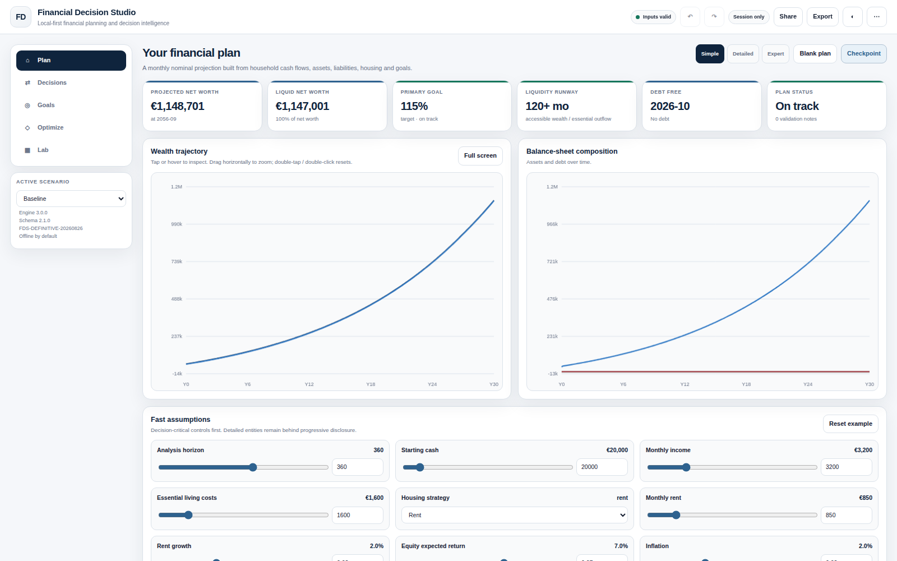

<a href="README.md">English</a> · <b>Italiano</b>

# Financial Decision Studio

Un'applicazione di pianificazione finanziaria personale e decision intelligence, local-first.

**Gratuita per uso personale / non commerciale consentito.** Funziona interamente nel browser — un unico file HTML, nessuna installazione, nessun account, nessun cloud richiesto, offline-first. I tuoi dati finanziari restano sul tuo dispositivo durante il normale utilizzo locale. Distribuita come *source-available* secondo la licenza contenuta in questo repository (non è una licenza open source approvata dalla OSI — vedi [Licenza](#licenza)).

Le schermate mostrano i dati di esempio integrati nell'app — nessun dato finanziario reale.

---

## Che cos'è

Financial Decision Studio è un'applicazione di pianificazione finanziaria personale contenuta in un singolo file HTML. Costruisce una proiezione mensile della situazione economico-patrimoniale di un nucleo familiare e permette di confrontare decisioni alternative — affitto vs acquisto, anticipare il mutuo vs investire, refinance, pensione e altro — mantenendo sempre esplicite le ipotesi. La filosofia del prodotto è supportare decisioni, non fare previsioni: ogni risultato è la conseguenza meccanica delle ipotesi inserite, e l'app è pensata per mostrare quanto una decisione sia sensibile a quelle ipotesi, non per fornire un singolo numero previsionale.

**Nota sull'interfaccia:** l'app usa un'interfaccia in inglese. Questa guida rapida mantiene i nomi reali dell'interfaccia in inglese e li spiega in italiano, coerentemente con la [guida utente completa](docs/USER_GUIDE_IT.md).

## Funzionalità principali

Basate sulla release 3.0.0 attuale:

- **Modellazione del nucleo familiare** — cassa iniziale, Accounts/Assets/Positions, Income, Expenses, Housing (affitto o proprietà + mutuo), Additional Properties, altre Liabilities, Goals, Events di vita, Insurance & protection, e Financial Policies (reserve, invest surplus, rebalance).
- **Tre livelli di profondità** — modalità Simple, Detailed ed Expert, per adattare il livello di dettaglio al tempo e alla precisione desiderati.
- **Dashboard e KPI** — Projected Net Worth (patrimonio netto proiettato), Liquid Net Worth (patrimonio netto liquido), Primary Goal, Liquidity Runway (autonomia di liquidità), Debt Free, Plan Status, oltre ai grafici wealth trajectory e balance-sheet composition.
- **Decisions** — baseline e scenari confrontati in modo equo, incluse le decisioni Rent vs Buy, Prepay vs Invest, Refinance, Retirement e Big Purchase.
- **Goals** — obiettivi Hard, Target e Aspirational, con importi/date target, valutati sia in termini nominali sia a potere d'acquisto corrente.
- **Optimize** — cerca il prezzo casa sostenibile (affordable home price), un LTV raggiungibile, o la capacità mensile esterna richiesta per rispettare i vincoli.
- **Lab** — simulazione Monte Carlo (paths, percentili, goal success, liquidity failure, drawdown, fan chart), punteggio di Robustness, analisi di Sensitivity con break-even, e Attribution di ciò che guida realmente il risultato.
- **Ledger e Audit** — un ledger in partita doppia con journal explorer, controlli di plan health e diagnostica integrata per la riproducibilità.
- **Actual vs Plan** — registra snapshot reali rispetto al piano, osserva la variance, e fai il rebase del piano senza riscrivere il passato.
- **Ipotesi fiscali** — input generici definiti dall'utente, più un pacchetto specifico per paese (Italy 2026) come approssimazione semplificata di pianificazione — non è un software di dichiarazione fiscale.
- **Persistenza locale e portabilità** — checkpoint, esportazione Plan JSON, esportazione Portable HTML, ed Encrypted Portable HTML protetta da password per backup e trasferimento del piano tra dispositivi.

Per la spiegazione completa di ogni funzionalità, consulta la [guida utente italiana completa](docs/USER_GUIDE_IT.md).

## Guida rapida

1. Scarica l'ultimo file HTML dalla pagina delle [**GitHub Releases**](../../releases/latest).
2. Apri il file in un browser desktop moderno (doppio clic, oppure trascinalo in una finestra del browser).
3. Inizia con **Quick Decision** per un confronto rapido, **Explore example** per vedere un piano precompilato, oppure **Build my plan** per partire dai tuoi numeri.
4. Esporta periodicamente un backup **Portable HTML** o **Plan JSON** — vedi [Privacy](#privacy) per capire perché è importante con una memorizzazione solo locale.

## Download

Il modo ufficiale per scaricare Financial Decision Studio è l'ultima **[GitHub Release](../../releases/latest)**. Verifica sempre il checksum SHA-256 in [`SHA256SUMS.txt`](SHA256SUMS.txt) (pubblicato anche in ogni release) prima di eseguire una copia scaricata.

## Documentazione

- [Guida utente italiana](docs/USER_GUIDE_IT.md) — la guida completa (Markdown; è disponibile anche una versione HTML in [`docs/USER_GUIDE_IT.html`](docs/USER_GUIDE_IT.html)).
- [English user guide](docs/USER_GUIDE_EN.md) — the complete guide in English (HTML version: [`docs/USER_GUIDE_EN.html`](docs/USER_GUIDE_EN.html)).

## Privacy

Financial Decision Studio è local-first: il file HTML rilasciato non effettua alcuna chiamata di rete (nessun `fetch`, nessun `XMLHttpRequest`, nessun analytics, nessun CDN) — verificato tramite ispezione diretta del file di release. I dati sono salvati sul dispositivo tramite `localStorage`/`IndexedDB`, oppure mantenuti solo in memoria in modalità Privacy/sessione. Vedi [`PRIVACY.md`](PRIVACY.md) (in inglese) per la spiegazione completa e verificata dal codice, incluse le cautele nell'aprire l'app da `file://` e il funzionamento dei backup Portable/Encrypted Portable HTML.

## Limiti

Financial Decision Studio è uno strumento di pianificazione e supporto alle decisioni, non uno strumento di previsione, non un software di dichiarazione fiscale e non un consulente. Limiti principali (elenco completo nella [guida utente](docs/USER_GUIDE_IT.md), Parte XIV):

- La logica fiscale (incluso il pacchetto Italy 2026) è un'approssimazione semplificata di pianificazione, non un software di dichiarazione fiscale.
- Gli strumenti Monte Carlo e Sensitivity descrivono un intervallo di esiti modellati in base alle tue ipotesi — non sono previsioni né probabilità di eventi reali.
- Multi-valuta, contabilità dettagliata dei tax lot e alcune sfumature su assicurazioni/pensione sono semplificate o fuori ambito.
- I dati di mercato e la normativa fiscale non vengono aggiornati automaticamente in tempo reale — le ipotesi vanno mantenute aggiornate dall'utente.

Vedi [`DISCLAIMER.md`](DISCLAIMER.md) (in inglese) per il disclaimer completo.

## Licenza

Financial Decision Studio è distribuita secondo la **[PolyForm Strict License 1.0.0](https://polyformproject.org/licenses/strict/1.0.0)** (SPDX: `PolyForm-Strict-1.0.0`) — vedi [`LICENSE`](LICENSE). In sintesi: **utilizzo** libero per **qualsiasi scopo non commerciale** (incluso l'uso personale, e l'uso da parte di enti no-profit, scuole, enti di ricerca e istituzioni governative); **l'uso commerciale non è consentito** senza autorizzazione separata, e la licenza **non** concede alcun diritto di ridistribuire copie o creare versioni modificate — scarica sempre la release ufficiale dalla pagina [Releases](../../releases/latest) di questo repository. È una licenza **source-available**, non una licenza open source approvata dalla OSI. Spiegazione completa in linguaggio semplice, incluso il motivo esatto per cui è stata scelta Strict invece della più permissiva PolyForm Noncommercial: [`LICENSING.md`](LICENSING.md) (in inglese).

## Uso commerciale

L'uso commerciale (rivendita, hosting a pagamento/SaaS, white-label, integrazione in un prodotto commerciale, uso all'interno di un'attività a scopo di lucro, ecc.) non è coperto dalla licenza sopra indicata e richiede un'autorizzazione separata da parte del titolare del copyright. Vedi [`COMMERCIAL.md`](COMMERCIAL.md) (in inglese).

## Sostieni il progetto

Financial Decision Studio è gratuita secondo la sua licenza — il sostegno è facoltativo. Vedi [`SUPPORT.md`](SUPPORT.md) (in inglese) per i modi attuali di sostenere lo sviluppo (Buy Me a Coffee / GitHub Sponsors, dove attivi). **Le donazioni non acquistano il software né concedono diritti oltre quelli previsti dalla licenza.**

## Segnalare problemi

Bug report, discrepanze di calcolo/modello e richieste di funzionalità sono benvenuti tramite le [Issues](../../issues) — usa i moduli predisposti e **non incollare mai dati finanziari reali**, usa cifre anonimizzate o di esempio. Questo progetto utilizza una licenza source-available non commerciale, quindi contributi di codice non richiesti non sono attualmente accettati, salvo accordo esplicito con il titolare del progetto; feedback sulla documentazione e segnalazioni sono invece molto benvenuti.

## Disclaimer

Financial Decision Studio è uno strumento di pianificazione finanziaria ed educativo. I risultati dipendono dalle ipotesi inserite e non costituiscono previsioni, garanzie, consulenza di investimento, consulenza fiscale o consulenza legale. Vedi [`DISCLAIMER.md`](DISCLAIMER.md) (in inglese) per i dettagli.
