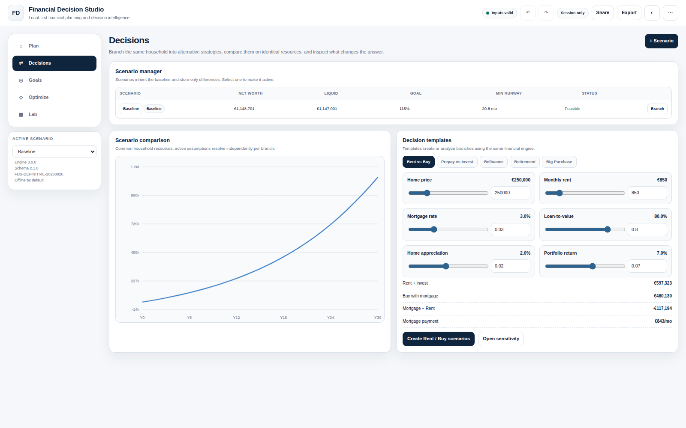
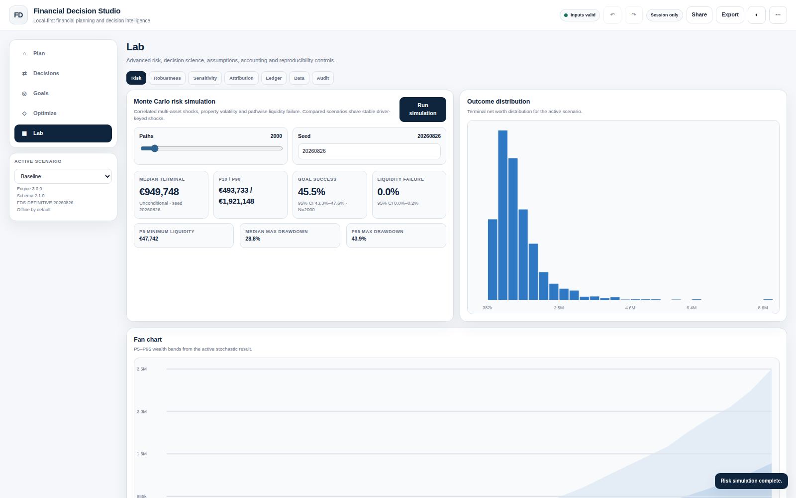
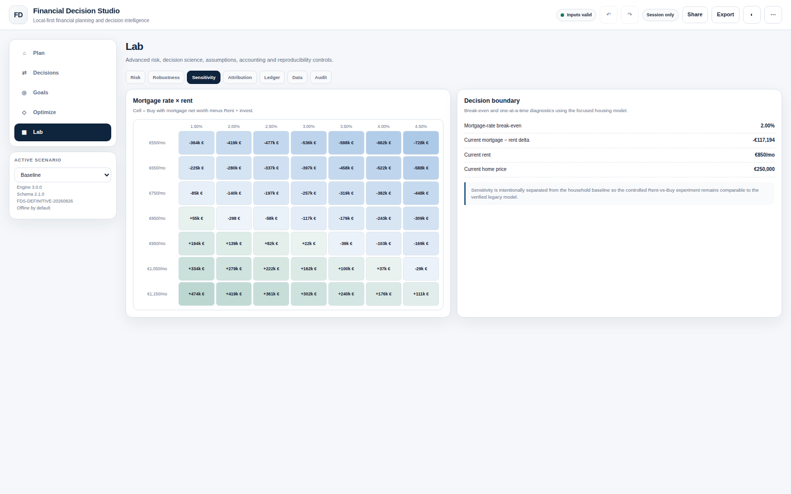
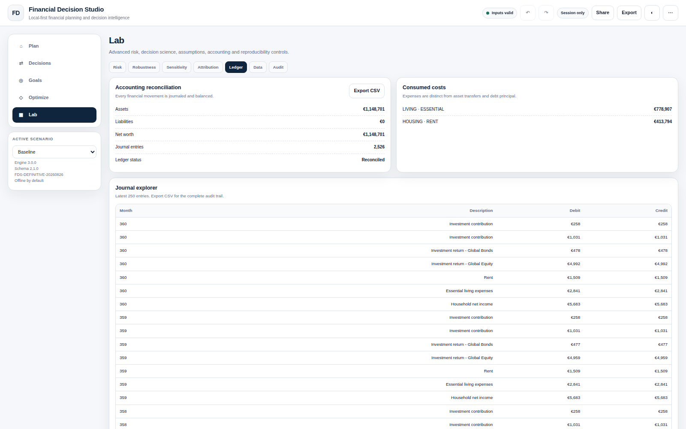

<b>English</b> · <a href="README.it.md">Italiano</a>

# Financial Decision Studio

A local-first personal financial planning and decision intelligence application.

**Free for permitted personal / non-commercial use.** Runs entirely in your browser — single HTML file, no installation, no account, no cloud required, offline-first. Your financial data stays on your own device during normal local use. Source-available under the license in this repository (not OSI-approved open source — see [Licence](#license)).

Screenshots use the app's built-in example data — nothing here is real financial data.

<table>
<tr>
<td></td>
<td></td>
</tr>
<tr>
<td></td>
<td></td>
</tr>
</table>

---

## What it is

Financial Decision Studio is a personal financial planning application built as a single, self-contained HTML file. It builds a month-by-month projection of a household's financial position and lets you compare alternative decisions — buy vs. rent, prepay vs. invest, refinance, retirement timing, and more — while keeping every assumption explicit and visible. The design philosophy is decision support, not prediction: every output is a mechanical consequence of the assumptions you provide, and the app is built to help you see how sensitive a decision is to those assumptions rather than to hand you a single forecasted number.

## Key capabilities

Based on the current 3.0.0 release:

- **Household modeling** — starting cash, accounts/assets/positions, income, expenses, housing (rent or own + mortgage), additional properties, other liabilities, goals, life events, insurance/protection, and financial policies (reserve, invest-surplus, rebalance rules).
- **Three planning depths** — Simple, Detailed, and Expert modes, so the level of detail matches how much time and precision you want to put in.
- **Dashboard & KPIs** — Projected Net Worth, Liquid Net Worth, Primary Goal tracking, Liquidity Runway, Debt-Free date, and overall Plan Status, plus wealth-trajectory and balance-sheet composition charts.
- **Decisions** — baselines and scenarios compared on a like-for-like basis, including Rent vs. Buy, Prepay vs. Invest, Refinance, Retirement, and Big Purchase scenarios.
- **Goals** — Hard, Target, and Aspirational goals with target amounts/dates, evaluated in both nominal and current-purchasing-power terms.
- **Optimize** — searches for an affordable home price, an achievable loan-to-value, or the required external monthly capacity to hit your constraints.
- **Lab** — Monte Carlo simulation (paths, percentiles, goal success rate, liquidity failure risk, drawdown, fan charts), Robustness scoring, Sensitivity analysis with break-even points, and Attribution of what's actually driving your outcome.
- **Ledger & Audit** — a double-entry ledger with a journal explorer, plan-health checks, and embedded diagnostics for reproducibility.
- **Actual vs. Plan** — record actual snapshots against your plan, see variance, and rebase the plan going forward without rewriting the past.
- **Tax assumptions** — generic user-defined tax/net inputs, plus a country-specific planning pack (Italy 2026) as a simplified planning approximation — not tax-filing software.
- **Local persistence & portability** — checkpoints, Plan JSON export, Portable HTML export, and password-protected Encrypted Portable HTML for backups and moving a plan between devices.

See the full [English user guide](docs/USER_GUIDE_EN.md) for the complete walkthrough of every feature (an [Italian guide](docs/USER_GUIDE_IT.md) is also available).

## Quick start

1. Download the latest HTML from the [**GitHub Releases**](../../releases/latest) page.
2. Open the file in a modern desktop browser (double-click it, or drag it into a browser window).
3. Start with **Quick Decision** for a fast comparison, **Explore example** to see a pre-filled plan, or **Build my plan** to start from your own numbers.
4. Periodically export a **Portable HTML** or **Plan JSON** backup — see [Privacy](#privacy) for why this matters with local-only storage.

## Download

The canonical way to get Financial Decision Studio is the latest **[GitHub Release](../../releases/latest)**. Always verify the SHA-256 checksum in [`SHA256SUMS.txt`](SHA256SUMS.txt) (also published in every release) before running a downloaded copy.

## Documentation

- [English user guide](docs/USER_GUIDE_EN.md) — the complete guide (Markdown; an HTML version is also included at [`docs/USER_GUIDE_EN.html`](docs/USER_GUIDE_EN.html)).
- [Guida utente italiana](docs/USER_GUIDE_IT.md) — la guida completa in italiano (versione HTML: [`docs/USER_GUIDE_IT.html`](docs/USER_GUIDE_IT.html)).

## Privacy

Financial Decision Studio is local-first: the released HTML file makes no network calls (no `fetch`, no `XMLHttpRequest`, no analytics, no CDN, nothing) — this has been verified by inspecting the release file. Your data is stored on your device via `localStorage`/`IndexedDB`, or kept in-memory only in Privacy/session mode. See [`PRIVACY.md`](PRIVACY.md) for the full, code-verified explanation, including the caveats of opening the app via `file://` and how Portable/Encrypted Portable HTML backups work.

## Limitations

Financial Decision Studio is a planning and decision-support tool, not a forecasting, tax-filing, or advisory product. Notable limits (see [`docs/USER_GUIDE_EN.md`](docs/USER_GUIDE_EN.md), Part XIV, for the complete list):

- Tax logic (including the Italy 2026 pack) is a simplified planning approximation, not tax-filing software.
- Monte Carlo and sensitivity tools describe a modeled range of outcomes under your assumptions — they are not predictions or probabilities of real-world events.
- Multi-currency, detailed tax-lot accounting, and some insurance/pension nuances are simplified or out of scope.
- Market data and tax rules are not fetched live — you supply or accept the built-in assumptions, and should keep them current yourself.

See [`DISCLAIMER.md`](DISCLAIMER.md) for the full disclaimer.

## License

Financial Decision Studio is distributed under the **[PolyForm Strict License 1.0.0](https://polyformproject.org/licenses/strict/1.0.0)** (SPDX: `PolyForm-Strict-1.0.0`) — see [`LICENSE`](LICENSE). In short: free to **use** for **any noncommercial purpose** (including personal use, and use by nonprofits, schools, research bodies, and government institutions); **commercial use is not permitted** without separate authorization, and the license does **not** grant any right to redistribute copies or create modified versions — always get the official release from this repository's [Releases](../../releases/latest) page. This is a **source-available** license, not an OSI-approved open source license. Full plain-language explanation, including exactly why Strict was chosen over the more permissive PolyForm Noncommercial license: [`LICENSING.md`](LICENSING.md).

## Commercial use

Commercial use (resale, paid hosting/SaaS, white-label, embedding in a commercial product, use inside a for-profit business, etc.) is not covered by the license above and requires separate authorization from the copyright holder. See [`COMMERCIAL.md`](COMMERCIAL.md).

## Support the project

Financial Decision Studio is free under its license — support is optional. See [`SUPPORT.md`](SUPPORT.md) for current ways to support development (Buy Me a Coffee / GitHub Sponsors, where active). **Donations do not purchase the software or grant any rights beyond the license.**

## Reporting issues

Bug reports, calculation/model discrepancies, and feature requests are welcome via [Issues](../../issues) — please use the issue forms and **never paste real financial data**, use anonymized/example figures instead. This project uses a noncommercial source-available license, so unsolicited code contributions are not currently accepted unless explicitly agreed with the project owner in advance; documentation feedback and reports are very welcome.

## Disclaimer

Financial Decision Studio is a financial planning and educational tool. Outputs depend on your assumptions and are not forecasts, guarantees, investment advice, tax advice, or legal advice. See [`DISCLAIMER.md`](DISCLAIMER.md) for details.
